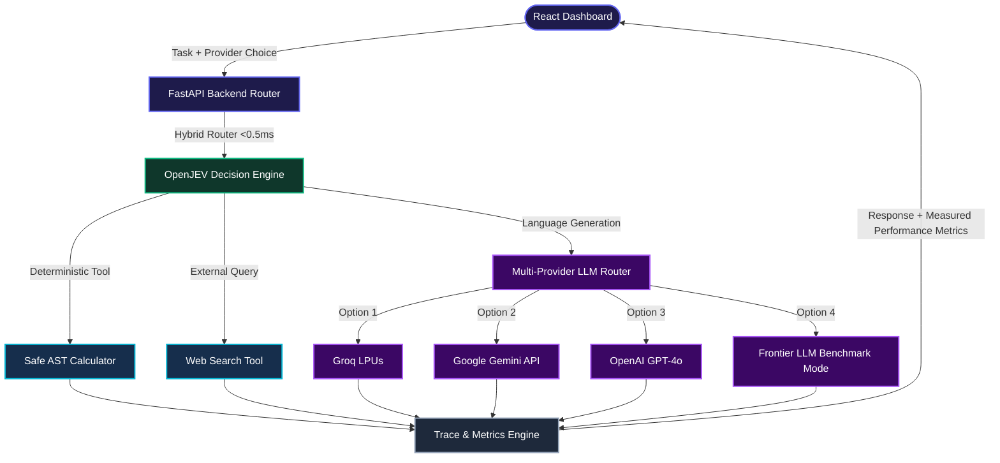

# AI Token Guardian

> **Decision-Driven AI Agent Optimization Layer**

AI Token Guardian is a high-speed, intelligent decision wrapper for agentic workflows. By routing incoming requests through a sub-millisecond hybrid decision engine before invoking LLMs or external tools, it eliminates unnecessary model calls, reduces latency, and slashes API token costs across multiple LLM providers (**Groq**, **Google Gemini**, **OpenAI**, and **Frontier Benchmark Mode**).

---

## 💡 Overview

Traditional AI agents invoke high-cost LLMs at every step of a workflow—even for simple arithmetic or direct tool tasks. AI Token Guardian introduces a pre-execution decision layer that evaluates task intent upfront and routes execution accordingly.

```
[ User Request ] 
       │
       ▼
┌─────────────────────────┐
│   OpenJEV Fast-Path     │ ──► Math Query? ──────► [ Safe AST Calculator ] (0 LLM Tokens, <1ms Latency)
│     Routing Layer       │ ──► Direct Answer? ───► [ Selected LLM Engine ] (Groq / Gemini / OpenAI)
└─────────────────────────┘ ──► Live Data Needed? ──► [ Web Search + LLM ]   (Bounded Tools)
```

---

## 🏗️ Architecture



### Component & Provider Matrix

| Layer | Technology / Providers | Functionality & Capabilities |
| :--- | :--- | :--- |
| **Frontend** | React 18, Vite, Vanilla CSS | Interactive dashboard with real-time execution trace, bar charts & 1-click LinkedIn export |
| **Backend API** | FastAPI, Uvicorn, Python 3.12 | Async router, multi-provider dispatch, trace collector, and fallback handler |
| **Decision Layer** | Sub-ms OpenJEV Fast-Path Engine | Intent classification (`calculator`, `web_search`, `needs_llm`, `needs_external_info`) |
| **Execution Tools** | Python AST, DDG Search | Zero-LLM math computation and web information retrieval |
| **LLM Providers** | **Groq LPU** (`openai/gpt-oss-20b`) | Ultra-fast hardware-accelerated LLM generation |
| | **Google Gemini** (`gemini-1.5-flash`) | Free-tier capable generative model for zero-cost testing |
| | **OpenAI** (`gpt-4o-mini` / `gpt-4o`) | Commercial frontier LLM provider |
| | **Frontier LLM Sim** | Benchmark mode simulating frontier LLM latency & token costs |

---

## 📊 Performance Benchmarks: Naive Baseline vs Token Guardian

The system includes a side-by-side comparison engine (`POST /api/compare`):

| Scenario / Request | Naive Unbounded Agent | Token Guardian Agent | Efficiency Gain |
| :--- | :--- | :--- | :--- |
| **Pure Math Task** (`27 * 43`) | Always calls LLM (~1.8s, ~220 tokens) | Routes to AST Calculator | **100% Token Savings** (0.0ms Latency, 0 LLM Calls) |
| **Compound Request** (`Calculate 27 * 43 & explain interest`) | Double overhead (~2.6s, ~407 tokens) | Bounded tool + LLM (~1.8s, ~308 tokens) | **~30% Faster Latency & ~25% Token Reduction** |
| **Conceptual Query** (`TCP vs UDP`) | Speculatively runs tools + LLM | Bypasses tools, calls LLM directly | **50% Tool Reduction** |

---

## 🚀 Quick Start

### Prerequisites
- Python 3.9+
- Node.js 18+

### 1. Environment Setup

Copy `.env.example` to `.env` in the root folder:

```bash
cp .env.example .env
```

Add your preferred API key(s) to `.env`:

```env
OPENJEV_API_KEY=your_openjev_key_here

# Provider Options (Use any or all):
GROQ_API_KEY=your_groq_key_here
GEMINI_API_KEY=your_gemini_key_here
OPENAI_API_KEY=your_openai_key_here

# Default active provider: groq | gemini | openai | frontier_sim
LLM_PROVIDER=groq
```

### 2. Run Backend

```bash
cd backend
pip install -r requirements.txt
uvicorn app.main:app --port 8000 --reload
```
Backend API will be active at `http://localhost:8000`. Interactive API docs at `http://localhost:8000/docs`.

### 3. Run Frontend

In a new terminal:

```bash
cd frontend
npm install
npm run dev
```
Dashboard will open at `http://localhost:5173`.

---

## 🧪 Running Tests

Run the test suite with `pytest`:

```bash
python -m pytest tests/
```

---

## 📜 License

MIT License.
