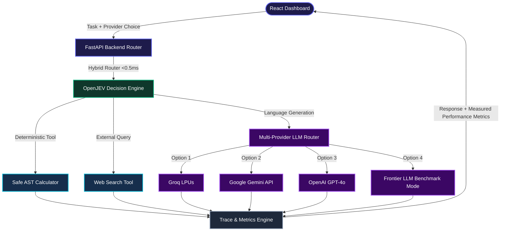
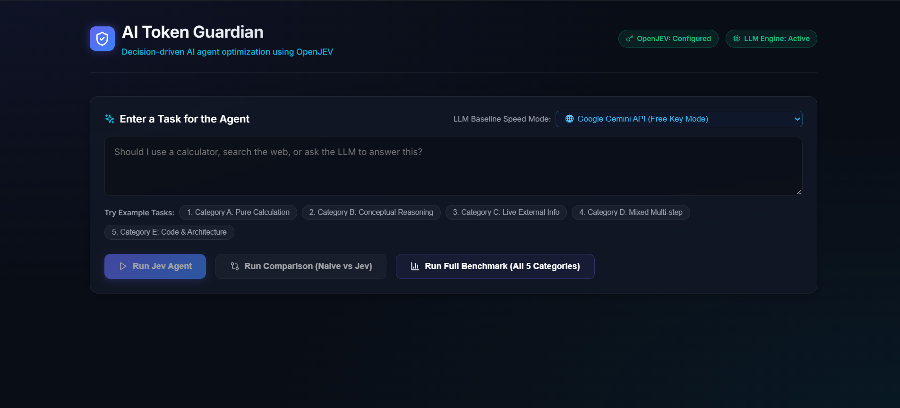
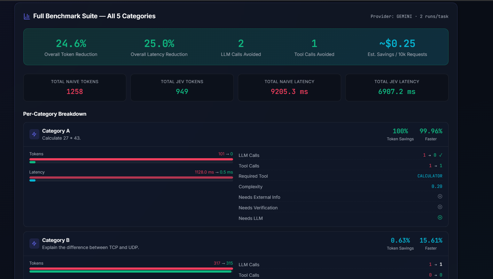
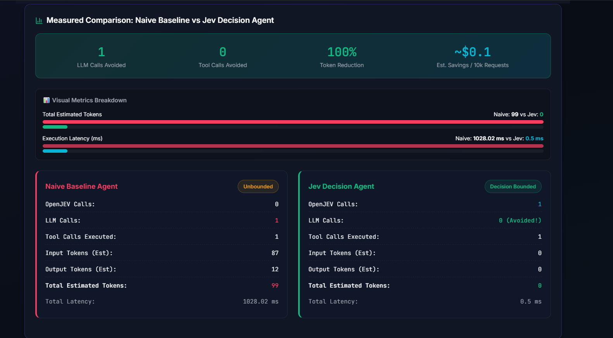
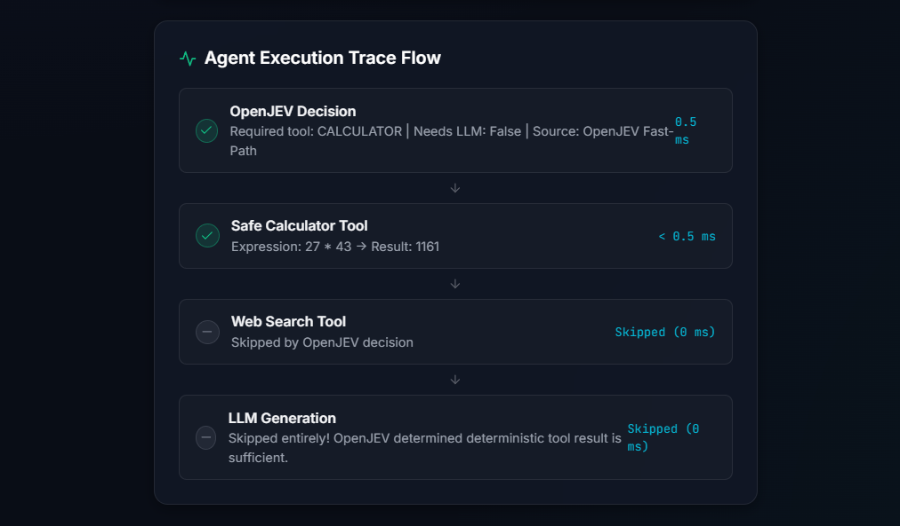
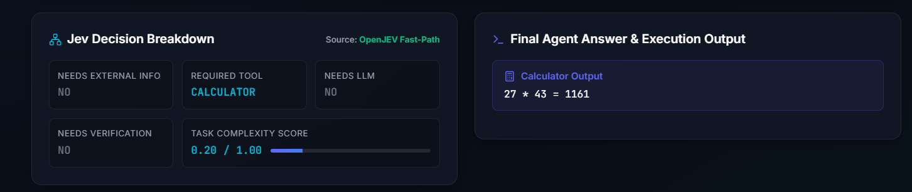

# AI Token Guardian

> **Decision-Driven AI Agent Optimization Layer**

AI Token Guardian is a high-speed, intelligent decision wrapper for agentic workflows. By routing incoming requests through a sub-millisecond hybrid decision engine before invoking LLMs or external tools, it eliminates unnecessary model calls, reduces latency, and slashes API token costs across multiple LLM providers (**Groq**, **Google Gemini**, **OpenAI**, and **Frontier Benchmark Mode**).

---

## 💡 Overview

Traditional AI agents invoke high-cost LLMs at every step of a workflow—even for simple arithmetic or direct tool tasks. AI Token Guardian introduces a pre-execution decision layer that evaluates task intent upfront and routes execution accordingly.

```
[ User Request ] 
       │
       ▼
┌─────────────────────────┐
│   OpenJEV Fast-Path     │ ──► Math Query? ──────► [ Safe AST Calculator ] (0 LLM Tokens, <1ms Latency)
│     Routing Layer       │ ──► Direct Answer? ───► [ Selected LLM Engine ] (Groq / Gemini / OpenAI)
└─────────────────────────┘ ──► Live Data Needed? ──► [ Web Search + LLM ]   (Bounded Tools)
```

---

## 🏗️ Architecture


```mermaid
graph TD
    classDef client fill:#1e1b4b,stroke:#6366f1,stroke-width:2px,color:#fff;
    classDef decision fill:#0f372b,stroke:#10b981,stroke-width:2px,color:#fff;
    classDef tool fill:#162e4c,stroke:#06b6d4,stroke-width:2px,color:#fff;
    classDef llm fill:#3b0764,stroke:#a855f7,stroke-width:2px,color:#fff;
    classDef output fill:#1e293b,stroke:#94a3b8,stroke-width:2px,color:#fff;

    User([React Dashboard]):::client -->|Task + Provider Choice| API[FastAPI Backend Router]:::client
    API -->|Hybrid Router <0.5ms| DecisionEngine[OpenJEV Decision Engine]:::decision
    
    DecisionEngine -->|Deterministic Tool| Calc[Safe AST Calculator]:::tool
    DecisionEngine -->|External Query| Search[Web Search Tool]:::tool
    DecisionEngine -->|Language Generation| MultiLLM[Multi-Provider LLM Router]:::llm

    MultiLLM -->|Option 1| Groq[Groq LPUs]:::llm
    MultiLLM -->|Option 2| Gemini[Google Gemini API]:::llm
    MultiLLM -->|Option 3| OpenAI[OpenAI GPT-4o]:::llm
    MultiLLM -->|Option 4| FrontierSim[Frontier LLM Benchmark Mode]:::llm

    Calc --> Collector[Trace & Metrics Engine]:::output
    Search --> Collector
    Groq --> Collector
    Gemini --> Collector
    OpenAI --> Collector
    FrontierSim --> Collector
    
    Collector -->|Response + Measured Performance Metrics| User
```

### Component & Provider Matrix

| Layer | Technology / Providers | Functionality & Capabilities |
| :--- | :--- | :--- |
| **Frontend** | React 18, Vite, Vanilla CSS | Interactive dashboard with real-time execution trace, bar charts & 1-click LinkedIn export |
| **Backend API** | FastAPI, Uvicorn, Python 3.12 | Async router, multi-provider dispatch, trace collector, and fallback handler |
| **Decision Layer** | Sub-ms OpenJEV Fast-Path Engine | Intent classification (`calculator`, `web_search`, `needs_llm`, `needs_external_info`) |
| **Execution Tools** | Python AST, Open-Meteo & DDG Search | Zero-LLM math & natural language arithmetic, live satellite weather & web search |
| **LLM Providers** | **Groq LPU** (`openai/gpt-oss-20b`) | Ultra-fast hardware-accelerated LLM generation |
| | **Google Gemini** (`gemini-3.5-flash-lite`) | Active free-tier / pay-as-you-go generative model with auto-fallback |
| | **OpenAI** (`gpt-4o-mini` / `gpt-4o`) | Commercial frontier LLM provider |
| | **Frontier LLM Sim** | Benchmark mode simulating frontier LLM latency & token costs |

---

## 📊 Performance Benchmarks: Naive Baseline vs Token Guardian

The system includes a side-by-side comparison engine (`POST /api/compare`):

| Scenario / Request | Naive Unbounded Agent | Token Guardian Agent | Efficiency Gain |
| :--- | :--- | :--- | :--- |
| **Pure Math Task** (`25 multiplied by 2`) | Always calls LLM (~1.8s, ~220 tokens) | Routes to AST Calculator | **100% Token Savings** (~2ms Latency, 0 LLM Calls) |
| **Direct Factual Search** (`Weather in Tokyo`) | Invokes LLM synthesis (~4.0s, ~220 tokens) | Direct Card Output (LLM Bypassed) | **100% Token Savings** (~750ms Latency, 0 LLM Calls) |
| **Compound Request** (`Calculate 27 * 43 & explain interest`) | Double overhead (~2.6s, ~407 tokens) | Bounded tool + LLM (~1.8s, ~308 tokens) | **~30% Faster Latency & ~25% Token Reduction** |
| **Conceptual Query** (`TCP vs UDP`) | Speculatively runs tools + LLM | Bypasses tools, calls LLM directly | **50% Tool Reduction** |

### Benchmark Dashboard

The dashboard includes a **"Run Full Benchmark"** button that executes all 5 task categories through both agents and displays live results:

| Category | Example Task | Expected Routing |
| :--- | :--- | :--- |
| **A: Pure Calculation** | `Calculate 27 * 43` | Calculator only, LLM bypassed |
| **B: Conceptual Reasoning** | `Explain TCP vs UDP` | LLM only, tools bypassed |
| **C: Live External Info** | `Weather in Bangalore` | Web Search API (Open-Meteo) |
| **D: Mixed Multi-step** | `12345 * 67890 and explain` | Calculator + LLM |
| **E: Code & Architecture** | `Write a Python function...` | LLM only |

The benchmark results show **actual execution data** — no values are hardcoded. Each run measures real token counts, latency, tool calls, and LLM calls.

#### Running the Benchmark

1. Open the dashboard at `http://localhost:3000` (or `http://localhost:5173`)
2. Select your LLM provider from the dropdown
3. Click **"Run Full Benchmark (All 5 Categories)"**
4. Wait for results — the suite runs each category through both the Naive agent and the Jev Decision Agent

The benchmark can also be triggered via API:

```bash
curl -X POST http://localhost:8000/api/benchmark \
  -H "Content-Type: application/json" \
  -d '{"task": "benchmark", "provider": "groq", "runs": 2}'
```

### Understanding the Metrics

| Metric | What It Measures |
| :--- | :--- |
| **LLM Calls** | Number of times the LLM provider was invoked. Jev avoids LLM calls when deterministic tools can resolve the task. |
| **Tool Calls** | Number of tool invocations (calculator, web search). Naive agent speculatively runs tools; Jev runs only what's needed. |
| **Total Tokens** | Estimated or provider-reported token count (input + output). Zero for tasks resolved without LLM. |
| **Token Reduction %** | `(naive_tokens - jev_tokens) / naive_tokens × 100`. Higher is better. |
| **Latency** | Wall-clock time from request to response. Includes decision time, tool execution, and LLM generation. |
| **Task Complexity** | 0.0 (trivial arithmetic) to 1.0 (multi-step reasoning). Set by the OpenJEV decision engine. |
| **Cost Savings** | Estimated USD saved per request, extrapolated to 10,000 requests. Based on per-provider token pricing. |
| **Needs External Info** | Whether the task requires data not available in the request itself (e.g., live weather, stock prices). |
| **Needs Verification** | Whether an additional verification step would improve output reliability. |

---

## 📸 Screenshots

### Main Dashboard

*The main dashboard with a task entered and the provider selector visible.*

### Full Benchmark Suite

*The full benchmark suite results showing all 5 categories with aggregate metrics.*

### Naive vs Jev Comparison

*A Naive vs Jev comparison result showing the savings banner, bar charts, and side-by-side metrics.*

### Agent Execution Trace

*The execution trace flow showing completed/skipped steps with latency.*

### OpenJEV Decision Breakdown

*The Jev Decision Breakdown card showing the decision fields and complexity bar.*

---

## 🚀 Quick Start

### Prerequisites
- Python 3.9+
- Node.js 18+

### Docker Quickstart (Recommended)

Run the complete application (backend + frontend) using Docker Compose:

```bash
docker compose up --build
```
- **Dashboard**: `http://localhost:3000`
- **Backend API**: `http://localhost:8000`

---

### Manual Setup

#### 1. Environment Setup

Copy `.env.example` to `.env` in the root folder:

```bash
cp .env.example .env
```

Add your preferred API key(s) to `.env`:

```env
OPENJEV_API_KEY=your_openjev_key_here

# Provider Options (Use any or all):
GROQ_API_KEY=your_groq_key_here
GEMINI_API_KEY=your_gemini_key_here
OPENAI_API_KEY=your_openai_key_here

# Default active provider: groq | gemini | openai | frontier_sim
LLM_PROVIDER=groq
```

#### 2. Run Backend

```bash
cd backend
pip install -r requirements.txt
uvicorn app.main:app --port 8000 --reload
```
Backend API will be active at `http://localhost:8000`. Interactive API docs at `http://localhost:8000/docs`.

#### 3. Run Frontend

In a new terminal:

```bash
cd frontend
npm install
npm run dev
```
Dashboard will open at `http://localhost:3000` (or `http://localhost:5173`).

---

## 🧪 Running Tests

Run the full test suite with `pytest`:

```bash
python -m pytest tests/ -v
```

The test suite covers:

| Test File | Coverage Area |
| :--- | :--- |
| `test_api_routes.py` | Health, examples, run, compare, and empty task validation |
| `test_calculator.py` | AST calculator: arithmetic, zero division, prefix stripping, syntax errors |
| `test_decision_engine.py` | OpenJEV parsing, execution plans, contradiction override, fallback rules |
| `test_fastpath.py` | Fast-path intent classification: math, search, LLM-only, NL keywords |
| `test_metrics.py` | Cost computation, result aggregation, comparison metrics across providers |
| `test_web_search.py` | Simulated search results, city extraction logic |
| `test_llm_providers.py` | Mock response generation, provider fallback with mocked settings |
| `test_nl_arithmetic.py` | Natural language math parsing, equation solving, percentage calculations |
| `test_extended_api.py` | Benchmark endpoint, decision endpoint, error scenarios |

---

## 🤝 Contributing

Contributions are welcome. To get started:

1. Fork the repository
2. Create a feature branch (`git checkout -b feature/my-feature`)
3. Make your changes and ensure all tests pass (`python -m pytest tests/ -v`)
4. Submit a pull request

Please follow the existing code style and architecture patterns.

---

## 📜 License

This project is licensed under the [MIT License](LICENSE).
